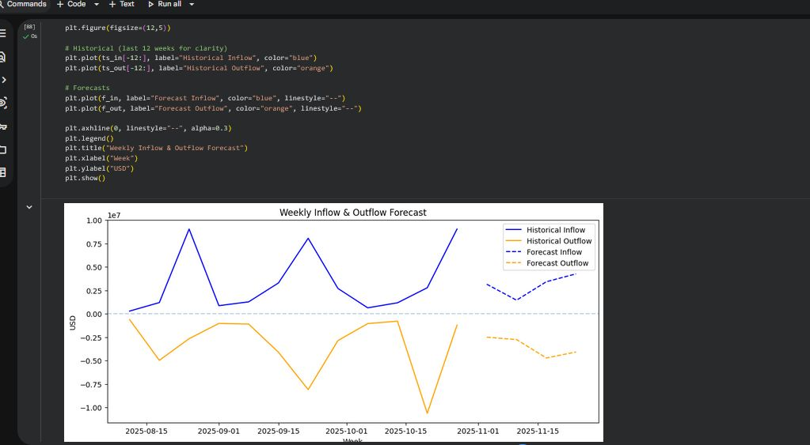
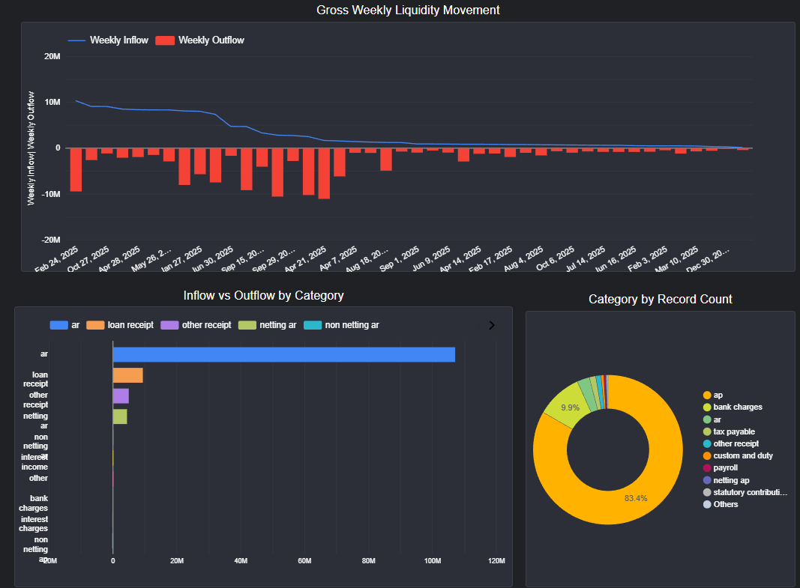
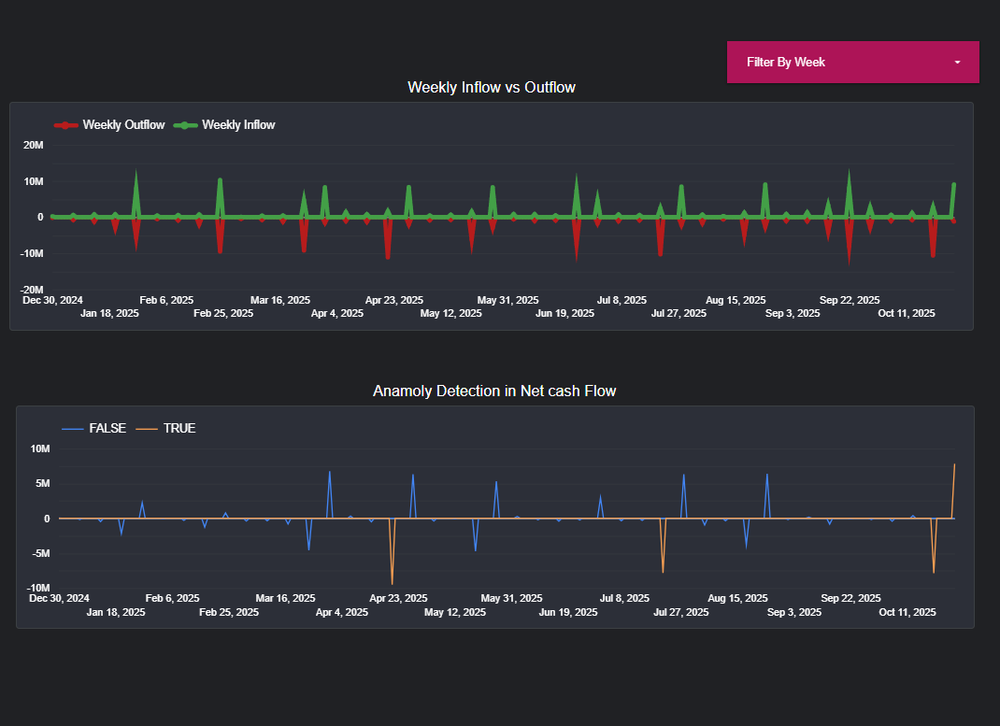
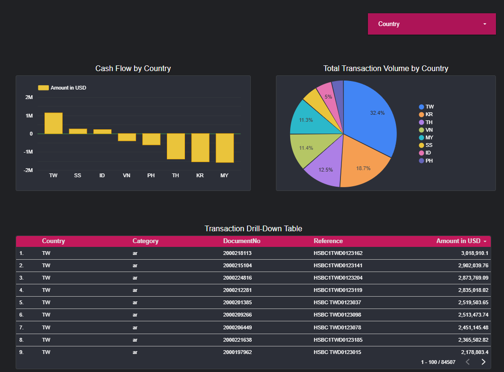

# 📊 Datathon Sales Forecast & Cash Flow Analytics

An end-to-end financial analytics project developed for a Datathon that analyzes financial transaction data, detects anomalies in cash flow, and forecasts future weekly cash movements using the Holt-Winters Exponential Smoothing model.

---

## 🚀 Features

- Financial transaction preprocessing and cleaning
- Weekly cash inflow and outflow analysis
- Net cash flow calculation
- Cash flow anomaly detection
- Weekly cash flow forecasting
- Interactive Power BI dashboards

---

## 🛠 Technologies Used

- Python
- Pandas
- NumPy
- Matplotlib
- Statsmodels
- Scikit-learn
- Holt-Winters Exponential Smoothing
- Power BI
- Jupyter Notebook

---

# 📷 Project Preview

## 🔮 Time-Series Forecasting (Python)

Forecast of future weekly cash inflow and outflow using the **Holt-Winters Triple Exponential Smoothing** model.

<p align="center">
  
</p>

---

## 💰 Liquidity & Transaction Dashboard (Power BI)

Provides a high-level overview of organizational liquidity and transaction distribution.

**Highlights**
- Gross Weekly Liquidity Movement
- Inflow vs Outflow by Category
- Category Distribution

<p align="center">
  
</p>

---

## 📈 Weekly Cash Flow & Anomaly Detection (Power BI)

Monitors weekly financial activity and identifies unusual cash flow patterns.

**Highlights**
- Weekly Inflow vs Outflow
- Weekly Cash Flow Trends
- Net Cash Flow Anomaly Detection

<p align="center">
  
</p>

---

## 🌍 Country Financial Dashboard (Power BI)

Provides country-level insights into financial performance and transaction distribution.

**Highlights**
- Cash Flow by Country
- Total Transaction Volume by Country
- Transaction Drill-Down Table

<p align="center">
  
</p>

---

## 📁 Repository Structure

```text
Datathon_Sales_Forecast/
│
├── assets/
│   ├── weekly_cashflow_forecast.png
│   ├── liquidity_transaction_dashboard.png
│   ├── weekly_cashflow_anomaly_dashboard.png
│   └── country_financial_dashboard.png
│
├── Datathon_Sales_Forecast.ipynb
├── Datathon Dataset.xlsx
├── README.md
└── requirements.txt
```

---

---

## 👥 Team

**Team Name:** **AceEngineers**

### Members

- **Alam Mir Tazwar**  
  Bachelor of Computer Science (Software Engineering)  
  Universiti Malaysia Pahang Al-Sultan Abdullah (UMPSA)

- **Yash Siddique Shahittya**  
  Bachelor of Computer Science (Software Engineering)  
  Universiti Malaysia Pahang Al-Sultan Abdullah (UMPSA)
